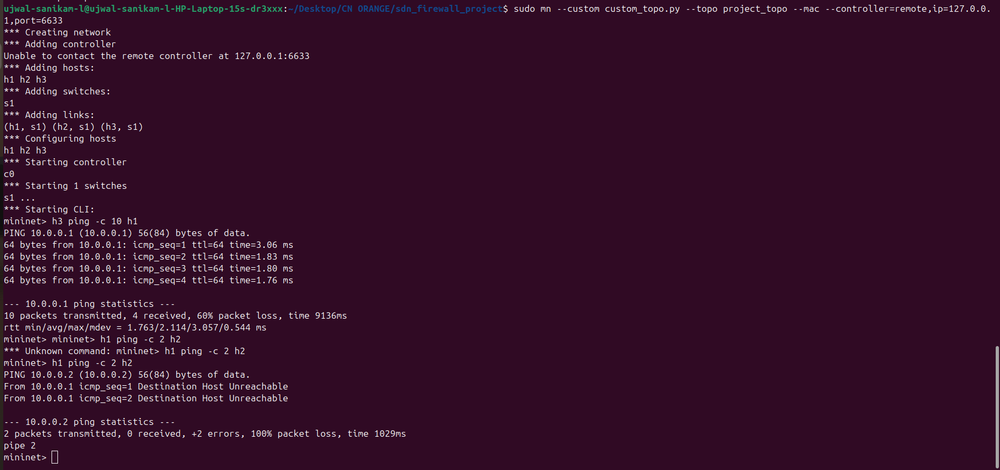
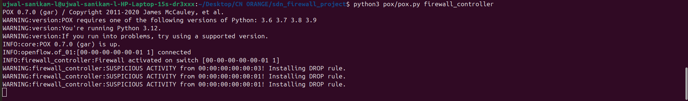

# Dynamic Host Blocking System - Orange Problem

**Name:** Ujwal Sanikam L  
**SRN:** PES1UG24CS506  
**Course:** Computer Networks (UE24CS252B)  

## 📑 Problem Statement
The objective of this project is to implement a Software-Defined Networking (SDN) solution using Mininet and an OpenFlow POX controller to dynamically block hosts based on their traffic behavior. The system must detect suspicious activity (packet floods), dynamically install blocking rules (match-action logic), verify the blocking functionally, and log all events.

## 🏗️ Topology Design
A custom single-switch, three-host topology (`custom_topo.py`) was chosen for this simulation. 

**Justification:** This design perfectly isolates the testing parameters for selective firewall blocking. It allows us to designate one host as a malicious actor (e.g., h3) and simulate an attack on a target (h1), while simultaneously proving that a third, benign host (h2) can maintain normal network communication. A simpler topology (two hosts) would not adequately demonstrate *selective* filtering, while a larger multi-switch topology would add unnecessary routing complexity without adding value to the core firewall logic.

## 🧠 Controller Logic (POX)
The controller (`firewall_controller.py`) acts as a dynamic learning switch and an active traffic monitor:
1. **Packet Monitoring:** The controller intercepts `packet_in` events triggered by the switch when it encounters unknown traffic.
2. **Threshold Detection:** It tracks the source MAC address of every packet. If a single host sends more than 5 packets within a short window, it is flagged as demonstrating suspicious, flood-like behavior.
3. **Flow Rule Implementation (Match-Action):** * **Normal Traffic:** Forwarded dynamically using `ofp_packet_out`.
   * **Suspicious Traffic:** Upon crossing the threshold, the controller constructs an OpenFlow `ofp_flow_mod` message matching the attacker's source MAC. Crucially, it installs this with an **empty action list**. In OpenFlow, no action translates to a **DROP rule**. This rule is installed on the switch hardware with a high priority, cutting off the attacker immediately.

## 🚀 Execution Steps
1. **Start the Mininet Topology:**
   Open a terminal and instantiate the custom topology pointing to the remote controller port (6633 for POX):
       sudo mn --custom custom_topo.py --topo project_topo --mac --controller=remote,ip=127.0.0.1,port=6633

2. **Start the POX Controller:**
   In a second terminal, execute the POX controller script (ensure the script is located in the `pox/ext/` directory):
       python3 pox/pox.py firewall_controller

## 🧪 Testing and Expected Output

### Scenario 1: Normal Traffic (Allowed)
We simulate a normal communication flow by having Host 1 send a standard number of pings to Host 2.
* **Command:** `mininet> h1 ping -c 2 h2`
* **Result:** The controller processes the `packet_in` events, recognizes the packet count is under the threshold, and allows the traffic. Output is 0% packet loss.

### Scenario 2: Suspicious Activity (Blocked)
We simulate a flood attack by having Host 3 rapidly ping Host 1 ten times.
* **Command:** `mininet> h3 ping -c 10 h1`
* **Result:** The first 4 packets are processed normally. Upon receiving the 5th packet, the POX controller logs a `WARNING: SUSPICIOUS ACTIVITY`. The hardware DROP rule is immediately installed, and packets 6-10 are silently discarded by the switch. Output is ~60% packet loss.

---

## 📸 Proof of Execution

### 1. Mininet Simulation (60% Packet Loss on h3 Flood)

### 2. POX Controller Logging Suspicious Activity

